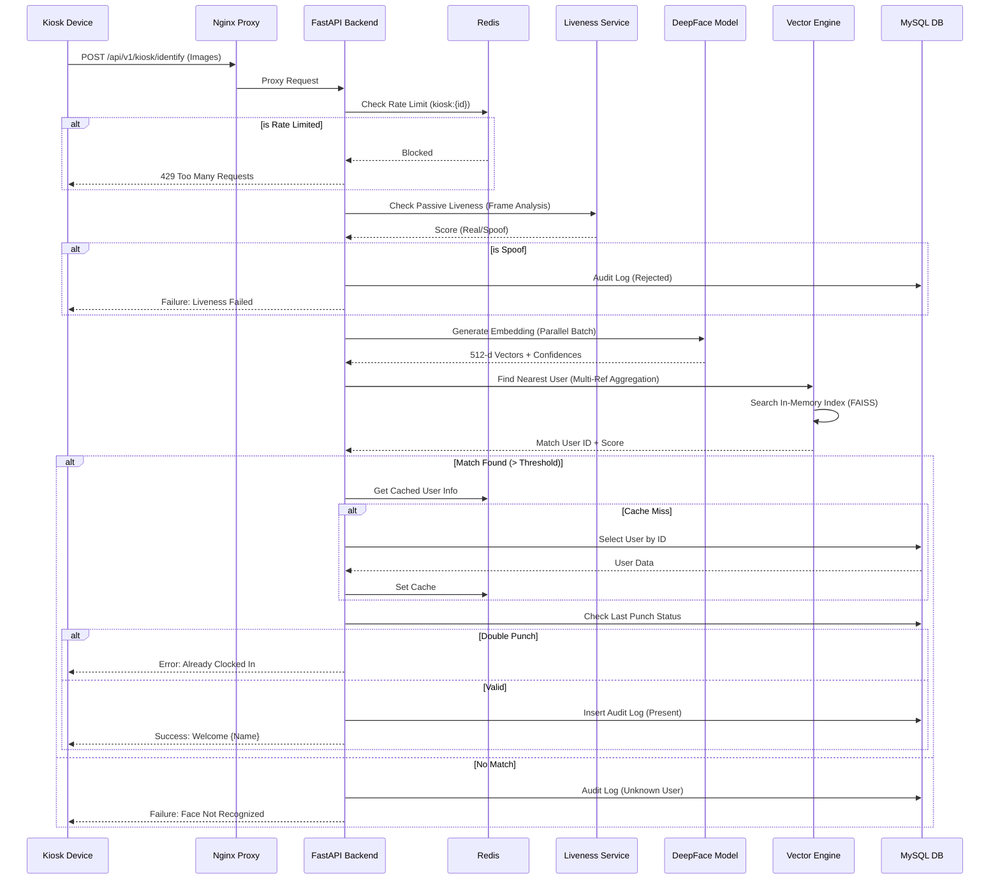

# System Architecture & Execution Flow Map

## 1. Physical / Container Network Map

This diagram illustrates the physical deployment of services, their network modes, and external connections. Note that the system utilizes **Host Networking** mode, meaning containers share the host's IP stack directly.

```mermaid
flowchart TD
    subgraph Host_Machine [Linux Host Server]
        style Host_Machine fill:#f9f9f9,stroke:#333,stroke-width:2px,color:black
        
        %% External Entry
        ExtUser[User / Kiosk Device] -->|HTTP:80| Nginx
        ExtUser -->|HTTPS:443| Nginx
        
        %% Frontend Container
        subgraph Frontend_Container [Container: prodify_face_frontend]
            style Frontend_Container fill:#e1f5fe,stroke:#0277bd,stroke-width:2px,color:black
            Nginx[Nginx Reverse Proxy]
            React[React SPA (Static)]
        end

        %% Backend Container
        subgraph Backend_Container [Container: prodify_face_backend]
            style Backend_Container fill:#e8f5e9,stroke:#2e7d32,stroke-width:2px,color:black
            FastAPI[FastAPI Server :8000]
            Worker[Gunicorn Workers]
            DeepFace[DeepFace Engine]
            VectorEng[Vector Engine (FAISS/Linear)]
        end

        %% Connections
        Nginx -->|Proxy_Pass http://127.0.0.1:8000| FastAPI
        FastAPI --> Worker
        Worker --> DeepFace
        Worker --> VectorEng

        %% Local Data Stores (Host-Level)
        MySQL[(MySQL Database)]
        Redis[(Redis Cache & Pub/Sub)]
        
        FastAPI -->|TCP:3306| MySQL
        FastAPI -->|TCP:6379| Redis
    end

    %% Cloud Services
    subgraph AWS_Cloud [AWS Cloud]
        style AWS_Cloud fill:#fff3e0,stroke:#ef6c00,stroke-width:2px,color:black
        S3[S3 Bucket: prodify-face-app]
    end

    FastAPI -->|HTTPS:443| S3
```

---

## 2. Logical Data Flow Map

This map traces the flow of data through the logical components of the system, highlighting the separation between the API layer, Processing layer, and Data layer.

```mermaid
flowchart LR
    %% Actors
    User((User/Kiosk))
    Manager((Manager))

    %% Gateways
    API[API Layer (FastAPI)]

    %% Services
    AuthServ[Auth Service]
    FaceServ[Face Service]
    LiveServ[Liveness Service]
    VectorServ[Vector Service]
    AuditServ[Audit Service]
    
    %% Storage
    DB[(MySQL)]
    Cache[(Redis)]
    ObjStore[(AWS S3)]
    
    %% Flows
    User -- 1. Identify Req (Images) --> API
    Manager -- Admin Actions --> API

    API -- JWT Check --> AuthServ
    AuthServ -- Lookup --> DB

    API -- 2. Check Liveness --> LiveServ
    LiveServ -- Passive Check --> API
    
    API -- 3. Generate Embedding --> FaceServ
    FaceServ -- Load Weights --> FaceServ
    
    API -- 4. Vector Search --> VectorServ
    VectorServ -- Read Index --> VectorServ
    VectorServ -- Sync Index --> Cache
    
    VectorServ -- Resolve User --> DB
    
    API -- 5. Log Transaction --> AuditServ
    AuditServ -- Write Log --> DB
    
    API -- 6. Fetch/Store Images --> ObjStore
```

---

## 3. End-to-End Execution Flow (Clock-In)

This sequence diagram details the exact steps for a user performing a clock-in operation via the Kiosk.



---

## 4. Connection & Communication Analysis

### Service Connectivity Table

| Service | Port | Protocol | Inbound From | Outbound To |
| :--- | :--- | :--- | :--- | :--- |
| **Nginx** | 80/443 | HTTP/HTTPS | Public Internet, Kiosks | Localhost:8000 |
| **FastAPI** | 8000 | HTTP | Localhost (Nginx) | MySQL:3306, Redis:6379, AWS S3:443 |
| **MySQL** | 3306 | TCP | FastAPI, Scripts | Disk I/O |
| **Redis** | 6379 | TCP | FastAPI, Workers | RAM |

### Critical Path Analysis

1.  **Latency Chokepoint: Face Embedding Generation**
    *   **Reason:** The creation of embeddings (`face_service.get_embedding`) is CPU/GPU intensive.
    *   **Architecture Mitigation:** The system uses `asyncio.gather` to process multiple frames in parallel, reducing the total wait time to roughly the duration of the slowest single-frame processing.

2.  **Scaling Bottleneck: Vector Search**
    *   **Reason:** The system currently holds the vector index in memory (Linear or FAISS Flat).
    *   **Limit:** As the user base grows > 10,000, linear search will slow down. The architecture has a built-in switch to `FaissEngine` (FlatIP) to handle medium scale, but extremely large scale would require an IVF index (not currently implemented).
    *   **Synchronization:** Updates are propagated via Redis Pub/Sub (`reload_index`), ensuring that if you scale horizontally to multiple worker processes, they all stay in sync.

3.  **Single Point of Failure: MySQL**
    *   **Reason:** All user resolution, audit logging, and configuration data reside in a single MySQL instance.
    *   **Impact:** If MySQL goes down, the Kiosk cannot resolve user IDs (unless cached in Redis) and cannot log attendance (AuditLog write will fail).

### Database Communication Profile

*   **Reads:** Heavy. Every recognition event triggers a User lookup (if not cached) and a "Last Punch" check.
*   **Writes:** Moderate. Every recognition attempt (successful or failed) writes to the `audit_logs` table.
*   **Transactions:** The "Clock-In" flow implies a transactional integrity need—specifically ensuring that the `AuditLog` entry is committed before confirming success to the user to prevent data loss.

### Network Behavior Explained

The system is designed for **low-latency edge inference** with a centralized data store.

*   **Registration:** Images are heavy payload. They flow from Client -> Nginx -> Backend -> S3. The database only stores the Reference Vector and the S3 URL.
*   **Recognition:** The Kiosk sends *images*, not vectors. This means the heavy lifting is done on the server (Backend). This increases network bandwidth usage (uploading images) but secures the proprietary vector algorithm on the server.
*   **Host Networking:** By using `network_mode: "host"`, the Docker containers bypass the Docker network bridge, removing NAT overhead. This provides a slight performance boost, critical for high-throughput real-time recognition systems.
