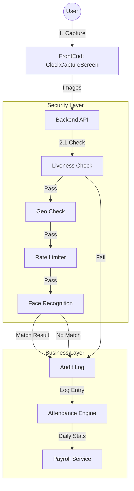

# Production Architecture Pipeline

This document outlines the strict architectural pipeline for the Face Attendance System. It details the exact sequence of operations from the frontend capture to the final payroll record, ensuring security, compliance, and data integrity.

## 🟢 1. Frontend: Capture Layer

**File:** `src/components/attendance/ClockCaptureScreen.tsx`

The entry point of the application. It handles the user interaction and physical data capture.

*   **Camera Preview**: Real-time feedback for the user.
*   **Burst Capture**: Captures 5 frames in rapid succession to ensure at least one high-quality image.
*   **Encrypted Transmission**: Sends frames securely to the backend API.

---

## 🔵 2. Backend: Security & Identity Layer

This layer acts as the gatekeeper. Requests are processed sequentially to reject invalid, spoofed, or unauthorized attempts *before* any resource-intensive recognition occurs.

### Step 2.1: Liveness Check (Anti-Spoofing)
**File:** `backend/services/liveness.py`
**Goal:** Verify the subject is a real human presence.
*   **Blur Check**: Rejects low-quality or blurry images.
*   **Motion/Texture Analysis**: Detects static photos or screens (anti-spoofing).
*   **Decision**: Must pass *before* any recognition is attempted.

### Step 2.2: Geo-Location Check
**File:** `backend/services/geo_service.py`
**Goal:** Verify the physical location of the device.
*   **Geofencing**: Ensures the kiosk/device is within authorized coordinates (if enabled).
*   **Policy Enforcement**: Blocks attempts from unauthorized locations.

### Step 2.3: Rate Limiting
**File:** `backend/services/rate_limiter.py`
**Goal:** Protect against abuse and brute-force attacks.
*   **Throttling**: Limits the number of attempts per minute/device.
*   **Feedback Loop**: Updates status based on success/failure of previous steps.

### Step 2.4: Face Recognition (Identity)
**Files:**
1.  `backend/services/face.py` (Embedding Generation)
2.  `backend/services/vector.py` (Vector Search & Decision)

**Goal:** Identify the human.
1.  **Generate Embedding**: Converts the face image into a 512-dimensional vector (`face.py`).
2.  **Vector Search**: Searches the FAISS/Vector database for the nearest match (`vector.py`).
3.  **Decision Logic**: Applies "Strict" vs "Rescue" matching thresholds to determine identity.

---

## 🟣 3. Backend: Record & Business Layer

Once the identity is securely established, the system processes the business logic.

### Step 3.1: Audit Logging
**File:** `backend/services/audit.py`
**Goal:** Immutable record of the event.
*   **Logs Details**: Records User ID, Timestamp, Confidence Score, and Result (Success/Failure).
*   **Evidence**: Saves a thumbnail image of the attempt.
*   **Reasoning**: Logs the specific reason for success or rejection (e.g., "Spoof Detected", "Low Confidence").

### Step 3.2: Attendance Engine
**File:** `backend/services/attendance.py`
**Goal:** Convert raw events into attendance status.
*   **Contextualization**: Matches IN/OUT punches.
*   **Shift Resolution**: Applies shift rules, grace periods, and weekly offs.
*   **Calculation**: Computes Late Entry, Early Exit, and Overtime minutes.

### Step 3.3: Payroll & Reporting
**File:** `backend/services/payroll_service.py`
**Goal:** Final aggregation for HR.
*   **Aggregation**: Summarizes daily stats into monthly reports.
*   **Payroll Calculation**: Applies salary rules based on the attendance data.

---

## 🧠 Why This Order Matters

1.  **Liveness BEFORE Face**: Prevents processing (and paying for) facial recognition on photo spoofs.
2.  **Geo BEFORE Attendance**: Ensures remote or spoofed GPS attempts cannot mark valid attendance.
3.  **Audit AFTER Decision**: Ensures the log contains the *final* result and reason, providing a complete audit trail.
4.  **Attendance AFTER Audit**: The attendance engine relies on the verified, immutable logs as the source of truth.

---

## Summary Flow

