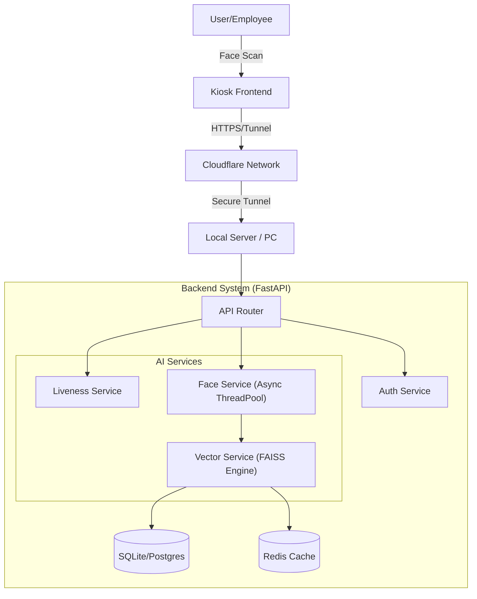

# PresencePal Technical Architecture & Implementation Guide

## 1. Executive Summary
**PresencePal** is a high-performance, AI-powered Face Attendance System designed for real-time employee tracking. It replaces traditional biometric hardware with standard tablets/kiosks, using advanced Computer Vision to identify staff securely and accurately.

The system is built to handle:
*   **Real-time Identification**: < 1 second response time.
*   **Offline Capability**: Works without internet, syncing when online.
*   **Anti-Spoofing**: Prevents photo/video attacks via liveness detection.
*   **Scalability**: Capable of handling hundreds of concurrent users via async processing.

---

## 2. Technology Stack

### **Frontend (The User Interface)**
*   **Framework**: [React](https://react.dev/) + [Vite](https://vitejs.dev/) (Fast build tool)
*   **Language**: TypeScript (Type safety)
*   **Styling**: [Tailwind CSS](https://tailwindcss.com/) + Shadcn/UI (Modern, responsive components)
*   **State Management**: React Query (Server state) + Context API (Auth state)
*   **PWA Features**: Service Workers for offline capabilities.

### **Backend (The Core Logic)**
*   **Framework**: [FastAPI](https://fastapi.tiangolo.com/) (High-performance Python web framework)
*   **Language**: Python 3.12+
*   **Validation**: Pydantic (Data validation)
*   **Concurrency**: Async/Await + ThreadPoolExecutor (for CPU-bound AI tasks)

### **AI & Computer Vision (The "Brain")**
*   **Face Recognition**: [DeepFace](https://github.com/serengil/deepface) framework.
*   **Model**: **ArcFace** (State-of-the-art accuracy, 512-dimensional embeddings).
*   **Vector Search**: 
    *   **FAISS** (Facebook AI Similarity Search) for high-scale/speed (Production).
    *   **Linear Search** (NumPy) for small-scale/fallback.
*   **Image Processing**: OpenCV (Image decoding, resizing, preprocessing).
*   **Liveness Detection**: Custom logic (Texture analysis, motion verification).

### **Database & Storage**
*   **Primary DB**: SQLite (with **WAL Mode** enabled for verified high concurrency). *Migration path: PostgreSQL.*
*   **ORM**: SQLModel (SQLAlchemy + Pydantic).
*   **Caching**: Redis (Optional/Fallback implemented for user profiles).
*   **Vector Store**: In-memory FAISS index (persisted from DB on startup).

### **Infrastructure**
*   **External Access**: **Cloudflare Tunnel** (`cloudflared`) - Exposes local `localhost:8080` safely to the public internet securely (HTTPS) without opening router ports.

---

## 3. System Architecture



---

## 4. How It Works: The "Punch" Flow (Detailed)

This is the most critical operation in the system. Here is exactly what happens when a user stands in front of the kiosk:

### **Phase 1: Capture (Frontend)**
1.  The Kiosk camera runs continuously.
2.  It captures a **burst of 5 frames** (images) to ensure at least one good angle.
3.  These images are compressed and sent to the backend endpoint `/api/v1/kiosk/identify`.

### **Phase 2: Validation (Backend)**
4.  **Request Receiver**: `backend/routers/kiosk.py` receives the images.
5.  **Rate Limiting**: Checks Redis/Memory to ensure this Kiosk isn't spamming requests (DoS protection).
6.  **Liveness Check** (`liveness_service.py`):
    *   Analyzes images for "blur" (is it a sharp real face?).
    *   Checks for "texture variance" (is it a flat screen/photo or a 3D face?).
    *   **Decision**: If spoof detected -> Reject immediately (Log as Security Event).

### **Phase 3: Recognition (The Heavy Lifting)**
7.  **Embedding Generation** (`face_service.py`):
    *   Since AI is CPU-heavy, the request is offloaded to a **ThreadPool**.
    *   **DeepFace (ArcFace)** converts the face image into a **512-number vector** (a unique digital fingerprint).
    *   *Optimization*: If the first frame has >99% confidence match, we "Early Exit" and skip processing the other 4 frames.
8.  **Vector Search** (`vector_service.py`):
    *   The 512D vector is compared against thousands of stored user vectors in the **FAISS Index**.
    *   It calculates the **Cosine Similarity** score (0.0 to 1.0).
    *   **Thresholds**:
        *   `> 0.50`: Strong Match (Accepted).
        *   `0.42 - 0.50`: "Rescue Match" (If multiple frames point to the same person, we accept it even if confidence is slightly lower).
        *   `< 0.42`: Unknown User.

### **Phase 4: Response**
9.  **Audit Logging**: The result (Success/Failure/Spoof) is written to the `auditlog` table in the DB.
10. **Feedback**: The API returns the User Name and ID.
11. **Frontend**: The Kiosk displays "Welcome, [Name]" and plays a success sound.

---

## 5. Offline Capabilities

What if the internet cuts out?
1.  **Detection**: The Frontend detects network failure.
2.  **Queueing**: Punches are saved locally in the browser's **IndexedDB** (`offlineStorage.ts`).
3.  **Sync**: When internet returns, a background service (`sync.ts`) batches these saved punches and sends/uploads them to `/api/v1/kiosk/sync`.
4.  **Reconciliation**: The backend inserts them into the database, respecting the original timestamps.

---

## 6. Key Internal Modules

### **`backend/services/face.py`**
*   **Role**: wrapper for DeepFace.
*   **Key Tech**: Uses `ThreadPoolExecutor` to make blocking AI calls "async" so the web server doesn't freeze.
*   **Safety**: Handles "No Face Found" errors gracefully.

### **`backend/services/vector.py`**
*   **Role**: The search engine.
*   **Logic**:
    *   On startup, loads all vectors from DB into RAM.
    *   Uses **FAISS** for O(1) or O(log n) search speed (very fast).
    *   Falls back to **Linear Search** (numpy dot product) if FAISS fails or dataset is tiny.
*   **Hybrid Logic**: Implements "Multi-Reference Aggregation" — uses multiple historically stored angles of a user to improve match rates.

### **`backend/core/logger.py.py`**
*   **Role**: Centralized logging.
*   **Format**: outputs **JSON** logs (e.g., `{"level": "info", "timestamp": "...", "message": "Face loaded"}`) instead of plain text. This is crucial for production monitoring/debugging.

---

## 7. External Connectivity (Cloudflare)

You are using **Cloudflare Tunnel (`cloudflared`)**.
*   **Function**: It creates a secure, encrypted outbound connection from your local machine to Cloudflare's edge network.
*   **URL**: `https://isa-cohen-editorials-carrier.trycloudflare.com` (Example).
*   **Security**:
    *   You do **NOT** need to open Port 80/443 on your router (Zero Trust).
    *   Traffic is HTTPS encrypted end-to-end.
    *   DDoS protection is provided by Cloudflare.

---

## 8. Database Schema Overview

*   **`User`**: Stores profile (Name, Employee ID, Role, Site ID).
*   **`FaceGallery`**: Stores the raw 512D vectors (blobs) linked to users.
*   **`AuditLog`**: The "Punch Clock" — records User ID, Time, Event (In/Out), Confidence, and Snapshot Path.
*   **`Shift`**: Defines work hours (Start, End, Grace Period).
*   **`Leaf/Holiday`**: HR management tables.

## 9. Troubleshooting & Maintenance

### Redis (Cache & Broker)
The system uses Redis heavily for speed and inter-process communication.

**Problem: "Redis Connection Error" or "OOM command not allowed"**
1.  **Check Status:**
    ```bash
    docker stats prodify_face_redis
    ```
    If memory usage is > 512MB, it might be full.
2.  **Fix:**
    The system is configured with `allkeys-lru`, so it *should* auto-delete old keys. If it's still full, you might need to FLUSH it (Warning: Clears all cache):
    ```bash
    docker exec -it prodify_face_redis redis-cli FLUSHALL
    ```
3.  **Logs:**
    View logs to see if it crashed:
    ```bash
    docker logs prodify_face_redis
    ```

**Problem: Workers out of sync (User registered but not recognized)**
*   This means the Pub/Sub signal failed.
*   **Fix:** Restart the backend services to force a reload from DB.
    ```bash
    docker-compose -f docker-compose.prod.yml restart backend
    ```
